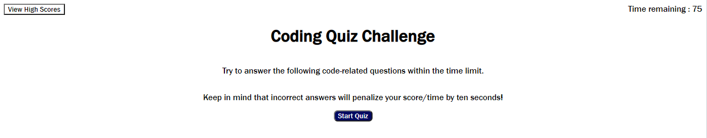

# Timed-Quiz

## Purpose
Challenge project designed to test my understanding of the DOM, web API and how javascript can be used to interface with these technologies. 

## Built With
*HTML
*CSS
*Javascript

## Website
https://agent-shields.github.io/Timed-Quiz/

## Screenshot
This image is what you should see when the page initially loads, once you press start button you will start the quiz within which you have 75 seconds to answer 5 questions. 

## Contribution
Made with ❤️ by Johnathan Shields 